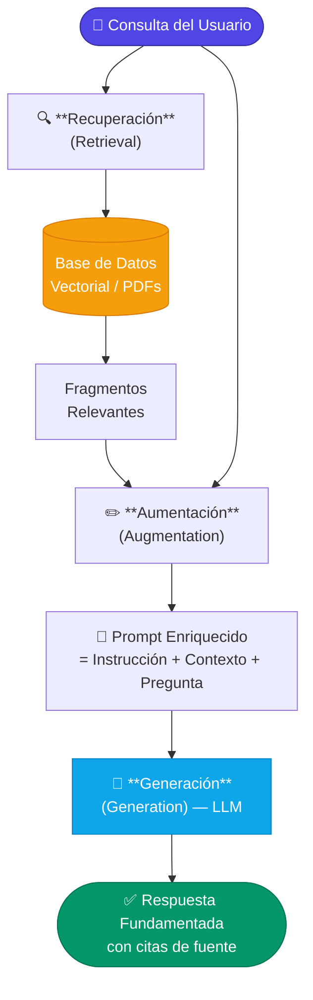

# 1.3 El enfoque de Generación Aumentada por Recuperación

El enfoque de **Generación Aumentada por Recuperación** (o *Retrieval-Augmented Generation*, RAG) representa un cambio de paradigma en cómo interactuamos con los Grandes Modelos de Lenguaje (LLMs). En lugar de confiar exclusivamente en el conocimiento "congelado" que el modelo adquirió durante su entrenamiento, RAG permite que el modelo acceda y utilice información externa, específica y actualizada en tiempo de ejecución.

### Concepto Fundamental

RAG es un patrón arquitectónico que optimiza la salida de un LLM al consultar una base de conocimientos externa antes de generar una respuesta. En el contexto de este curso, esa base de conocimientos son los documentos PDF de una organización. 

La idea central es simple pero potente: **"Si no lo sabes, búscalo antes de hablar"**. Un sistema RAG no intenta cambiar los pesos del modelo (como lo haría el *Fine-Tuning*), sino que proporciona al modelo el "libro abierto" (el contexto extraído del PDF) para que este pueda redactar una respuesta basada únicamente en esa evidencia.

### El Flujo de Trabajo RAG

Para entender cómo se implementa en .NET, debemos desglosar el proceso en tres etapas lógicas que ocurren en milisegundos cuando un usuario realiza una consulta:

1.  **Recuperación (Retrieval):** El sistema recibe la pregunta del usuario y busca en el corpus de documentos (PDFs previamente procesados) los fragmentos de texto que sean más relevantes para esa consulta.
2.  **Aumentación (Augmentation):** El sistema toma la pregunta original y la combina con los fragmentos recuperados en el paso anterior. Se construye un "prompt enriquecido" que incluye instrucciones explícitas para el modelo.
3.  **Generación (Generation):** El LLM recibe el prompt con el contexto adjunto y genera una respuesta coherente, fundamentada y precisa, citando a menudo las fuentes recuperadas.



### Representación Conceptual en C#

Aunque en secciones posteriores exploraremos librerías específicas como *Semantic Kernel* o *Azure AI Search*, la lógica de un motor RAG en .NET puede modelarse mediante la orquestación de servicios. A continuación, se muestra una abstracción de cómo se ve este flujo de trabajo:

```csharp
public class RagEngine
{
    private readonly IDocumentRetriever _retriever;
    private readonly ILLMGenerator _generator;

    public RagEngine(IDocumentRetriever retriever, ILLMGenerator generator)
    {
        _retriever = retriever;
        _generator = generator;
    }

    public async Task<string> AskQuestionAsync(string userQuery)
    {
        // 1. Recuperación: Buscamos en nuestros PDFs los fragmentos más relevantes
        // Esto suele implicar búsqueda vectorial (se verá en la sección 2.5)
        var relevantContexts = await _retriever.GetRelevantChunksAsync(userQuery, limit: 3);

        // 2. Aumentación: Construimos el prompt con el contexto
        string contextBlock = string.Join("\n", relevantContexts.Select(c => c.Text));
        
        string augmentedPrompt = $@"
            Eres un asistente experto. Utiliza ÚNICAMENTE la siguiente información para responder.
            Si la respuesta no está en el contexto, di que no lo sabes.

            Contexto:
            {contextBlock}

            Pregunta del usuario:
            {userQuery}
            ";

        // 3. Generación: El LLM procesa el prompt enriquecido
        return await _generator.GenerateResponseAsync(augmentedPrompt);
    }
}
```

### Ventajas del Enfoque RAG en el Ecosistema .NET

Implementar RAG en el entorno empresarial de .NET ofrece beneficios críticos que el uso directo de un chatbot comercial (como ChatGPT) no puede igualar:

*   **Verificabilidad y Citas:** Al tener control sobre el componente de recuperación, podemos saber exactamente de qué página y de qué PDF se extrajo la información, permitiendo al usuario final auditar la respuesta.
*   **Reducción de Alucinaciones:** Al restringir el espacio de respuesta del modelo al contexto proporcionado, se minimiza drásticamente la tendencia del LLM a inventar hechos (problema que analizaremos en la sección 2.1).
*   **Seguridad de Datos:** La información sensible de los PDFs nunca se utiliza para re-entrenar el modelo global. Los datos se mantienen dentro de la infraestructura controlada por la aplicación .NET, cumpliendo con estándares de privacidad (ver sección 2.8).
*   **Actualización en Tiempo Real:** Si un PDF se actualiza o se añade un nuevo documento técnico, el sistema RAG puede "aprender" esta información instantáneamente simplemente indexándola, sin necesidad de procesos costosos de entrenamiento.

### Componentes Clave en el Desarrollo con C#

Para que este enfoque funcione sobre archivos PDF, el desarrollador .NET debe dominar tres pilares que cubriremos en las siguientes unidades:
1.  **Ingesta:** Transformar el PDF binario en texto estructurado y fragmentado (*Chunking*).
2.  **Embeddings:** Convertir texto en vectores numéricos para que la búsqueda sea semántica y no solo por palabras clave.
3.  **Orquestación:** Unir el flujo mediante patrones de diseño robustos y el uso de SDKs modernos para IA.