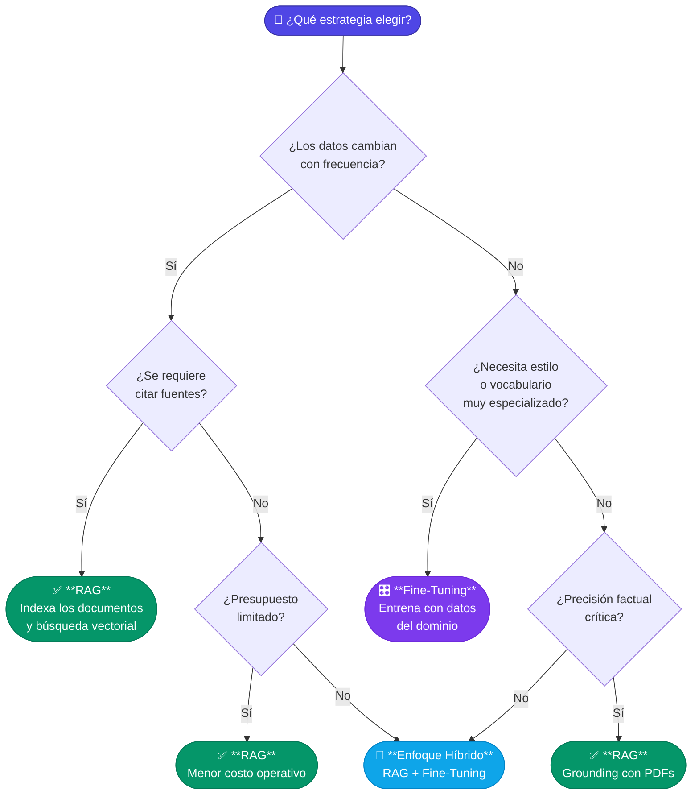

# 1.4 RAG vs. Fine-Tuning: Cuándo usar cada enfoque

Para construir aplicaciones de inteligencia artificial generativa robustas en el ecosistema .NET, una de las decisiones arquitectónicas más críticas es elegir entre **RAG (Retrieval-Augmented Generation)** y **Fine-Tuning (Ajuste Fino)**. Aunque a menudo se presentan como alternativas, cumplen objetivos distintos y, en muchos casos, son complementarios.

A continuación, analizamos las diferencias fundamentales, sus casos de uso y cómo se posicionan dentro de un desarrollo con C# y .NET.

---

### 1. Entendiendo los conceptos

Para diferenciar ambos enfoques, podemos usar una analogía educativa:
*   **Fine-Tuning:** Es equivalente a que un estudiante estudie durante meses para memorizar y asimilar un tema específico. El conocimiento se vuelve parte intrínseca de su "cerebro" (los pesos del modelo).
*   **RAG:** Es equivalente a que ese mismo estudiante se presente a un examen con un libro abierto. No necesita memorizar todo, sino saber buscar la información relevante en el libro (el PDF o la base de datos) y redactar una respuesta basada en lo que acaba de leer.

#### Fine-Tuning (Ajuste Fino)
Consiste en tomar un modelo ya pre-entrenado (como GPT-4 o Llama 3) y continuar su entrenamiento con un conjunto de datos más pequeño y especializado. Esto modifica los pesos internos del modelo para que aprenda patrones, estilos o vocabularios específicos.

#### RAG (Generación Aumentada por Recuperación)
No modifica el modelo. En su lugar, el sistema recupera fragmentos de información relevante de una fuente externa (como veremos en la sección 2.5 sobre bases de datos vectoriales) y los inyecta en el *prompt* del LLM como contexto para que este genere una respuesta fundamentada.

---

### 2. Cuadro Comparativo: RAG vs. Fine-Tuning

| Característica | RAG | Fine-Tuning |
| :--- | :--- | :--- |
| **Conocimiento externo** | Excelente para datos dinámicos y nuevos. | Estático; limitado a la fecha de corte del entrenamiento. |
| **Alucinaciones** | Minimizadas (el modelo cita fuentes). | Presentes (el modelo intenta "recordar" datos). |
| **Transparencia** | Alta (puedes ver qué documento se usó). | Baja (es una "caja negra"). |
| **Costo de actualización** | Bajo (solo indexar nuevos documentos). | Alto (requiere re-entrenamiento y cómputo GPU). |
| **Personalización de estilo** | Limitada (vía Few-shot prompting). | Excelente (aprende tonos, sintaxis y formatos). |
| **Privacidad/Seguridad** | Fácil de implementar (RBAC a nivel de datos). | Difícil (los datos se "hornean" en el modelo). |

---

### 3. ¿Cuándo usar cada enfoque?

#### Utilice RAG cuando:
1.  **Los datos cambian frecuentemente:** Si sus PDFs (manuales técnicos, normativas legales, catálogos) se actualizan semanalmente, el Fine-Tuning es inviable por costo y tiempo.
2.  **La precisión factual es crítica:** En aplicaciones empresariales, es vital que el modelo no invente datos. RAG permite el "grounding" (anclaje) de la respuesta.
3.  **Necesita citar fuentes:** Si el usuario final requiere saber de qué página de qué PDF proviene la información.
4.  **Optimización de costos:** Implementar una búsqueda vectorial con `Azure AI Search` o `Qdrant` suele ser más económico que mantener un ciclo de entrenamiento continuo.

#### Utilice Fine-Tuning cuando:
1.  **Vocabulario extremadamente especializado:** Si trabaja en un nicho con terminología que el LLM base no comprende en absoluto.
2.  **Restricciones de formato:** Si necesita que el modelo responda siempre en un JSON muy específico o en un lenguaje de programación propietario donde el *prompting* no es suficiente.
3.  **Reducción de latencia y tokens:** Un modelo ajustado puede no necesitar instrucciones largas en el sistema (System Prompt), lo que reduce el consumo de tokens en cada llamada.

---



### 4. Perspectiva desde .NET: Ejemplo conceptual

En .NET, la diferencia se refleja en cómo configuramos nuestras peticiones utilizando SDKs como `Azure.AI.OpenAI` o `Semantic Kernel`.

Mientras que el **Fine-Tuning** se invoca simplemente llamando a un `modelId` personalizado, el **RAG** implica una orquestación (pipeline) que veremos en profundidad en el Capítulo 3.

```csharp
// --- ESCENARIO 1: FINE-TUNING ---
// El conocimiento ya está "dentro" del modelo desplegado.
var fineTunedClient = new ChatClient(
    model: "mi-modelo-ajustado-legal-v2", 
    apiKey: "..."
);

// --- ESCENARIO 2: RAG (Simplificado) ---
// El conocimiento se inyecta dinámicamente en tiempo de ejecución.
public async Task<string> ResponderConRAG(string consultaUsuario)
{
    // 1. Recuperación (Retrieval): Buscamos en nuestra DB vectorial (p. ej. Qdrant o Azure AI Search)
    // Este proceso se detalla en la sección 2.5 y 3.2 del curso.
    string contextoExtraido = await _vectorService.SearchAsync(consultaUsuario);

    // 2. Generación: Inyectamos el contexto en el prompt
    var prompt = $@"Utiliza únicamente el siguiente contexto para responder:
                   Contexto: {contextoExtraido}
                   Pregunta: {consultaUsuario}";

    var response = await _chatClient.CompleteChatAsync(prompt);
    return response.Value.Content;
}
```

---

### 5. El enfoque híbrido: Lo mejor de ambos mundos

No siempre es una elección excluyente. Las arquitecturas más avanzadas en .NET utilizan ambos:
1.  **Fine-Tuning** para que el modelo aprenda el tono corporativo y la estructura de salida (por ejemplo, hablar como un asistente financiero senior y devolver resultados en una estructura C# específica).
2.  **RAG** para proporcionar al modelo la información actualizada de los mercados o los balances de los clientes almacenados en documentos PDF.

En las siguientes secciones del curso, nos enfocaremos primordialmente en **RAG**, dado que es el patrón arquitectónico más demandado y eficiente para trabajar con repositorios de documentos PDF en el entorno empresarial actual.