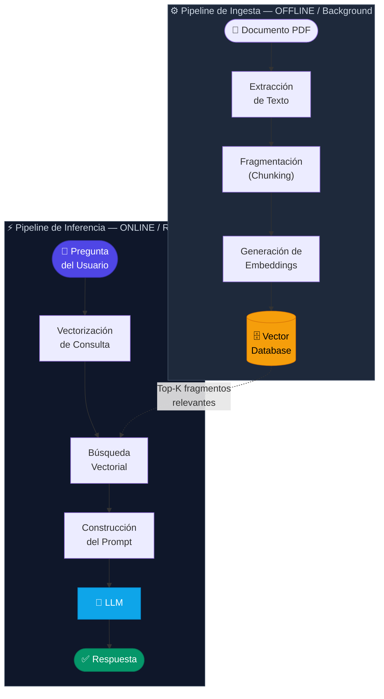

# 2.3 Arquitectura de RAG en aplicaciones .NET *(Visión General)*

Para comprender cómo se integra un sistema RAG en el ecosistema .NET, es fundamental visualizarlo no como un único proceso lineal, sino como una arquitectura desacoplada compuesta por dos flujos de trabajo principales: el **Pipeline de Ingesta (Preparación de datos)** y el **Pipeline de Inferencia (Consulta y Generación)**.

En una aplicación .NET moderna (ya sea una Web API con ASP.NET Core, un Worker Service o una aplicación Blazor), esta arquitectura actúa como el puente entre los datos no estructurados del negocio (PDFs) y las capacidades cognitivas de los Modelos de Lenguaje de Gran Escala (LLMs).

### 2.3.1 Los dos pilares de la arquitectura RAG

#### A. El Pipeline de Ingesta (Offline/Background)
Este flujo ocurre generalmente de forma asíncrona. Su objetivo es transformar documentos PDF estáticos en una base de conocimientos vectorizada que el sistema pueda "consultar" matemáticamente.

1.  **Carga y Extracción:** Se utilizan librerías de C# para leer el contenido del PDF.
2.  **Transformación (Chunking):** El texto se divide en fragmentos manejables para no exceder la ventana de contexto del modelo.
3.  **Embedding:** Cada fragmento se envía a un modelo de *Embedding* (como `text-embedding-3-small` de OpenAI) que devuelve un vector (un array de números de punto flotante).
4.  **Almacenamiento:** Los vectores, junto con el texto original y sus metadatos, se guardan en una **Vector Database**.

#### B. El Pipeline de Inferencia (Online/Real-time)
Este flujo se activa cuando un usuario realiza una pregunta a través de la interfaz de la aplicación .NET.

1.  **Vectorización de la consulta:** La pregunta del usuario se convierte en un vector usando el mismo modelo de *Embedding* del pipeline de ingesta.
2.  **Búsqueda Vectorial (Retrieval):** Se busca en la base de datos de vectores los fragmentos de PDF más similares semánticamente a la pregunta.
3.  **Aumentación del Prompt:** Se construye un prompt enriquecido que incluye:
    *   Instrucciones del sistema (System Message).
    *   Contexto recuperado (los fragmentos del PDF).
    *   La pregunta original del usuario.
4.  **Generación:** El LLM procesa el prompt y genera una respuesta basada exclusivamente (o principalmente) en el contexto proporcionado.

---



### 2.3.2 Componentes de Software en el Ecosistema .NET

Para implementar esta arquitectura, una solución profesional en C# suele estructurarse mediante el uso de orquestadores y abstracciones de servicios:

*   **Orquestador (Microsoft Semantic Kernel):** Es el estándar de facto en .NET. Actúa como el "cerebro" que coordina las llamadas a los modelos de IA, la gestión de la memoria y la ejecución de funciones nativas de C#.
*   **Abstracción de Datos:** Se utilizan interfaces como `IVectorStore` (introducida recientemente por Microsoft) para interactuar con diferentes proveedores de bases de datos vectoriales (Azure AI Search, Qdrant, Milvus) de forma agnóstica.
*   **Consumo de Modelos:** Se emplea el SDK oficial de `Azure.AI.OpenAI` o implementaciones de `Microsoft.Extensions.AI` para una integración fluida con la inyección de dependencias de .NET.

### 2.3.3 Representación de la Arquitectura en Código (C#)

A continuación, se presenta un esquema conceptual de cómo se configuran estos componentes en una aplicación .NET típica utilizando el enfoque de servicios:

```csharp
// Ejemplo de configuración de la arquitectura RAG en Program.cs
using Microsoft.SemanticKernel;
using Microsoft.Extensions.DependencyInjection;

var builder = WebApplication.CreateBuilder(args);

// 1. Configuración del Orquestador (Semantic Kernel)
builder.Services.AddKernel()
    .AddAzureOpenAIChatCompletion(deploymentName: "gpt-4o", endpoint: "...", apiKey: "...")
    .AddAzureOpenAITextEmbeddingGeneration(deploymentName: "text-embedding-3", endpoint: "...", apiKey: "...");

// 2. Registro del Vector Store (Ejemplo con Qdrant o Azure AI Search)
builder.Services.AddSingleton<IVectorStore>(sp => {
    // La implementación específica se detallará en la sección 2.5.2
    return new AzureAISearchVectorStore(endpoint: "...", apiKey: "...");
});

// 3. Registro de servicios de negocio para RAG
builder.Services.AddScoped<IPdfIngestionService, PdfIngestionService>();
builder.Services.AddScoped<IRagOrchestrator, RagOrchestrator>();

var app = builder.Build();
```

### 2.3.4 Flujo de Datos Técnico

Para visualizar la interacción entre los componentes tratados anteriormente y los que se verán en los siguientes capítulos, consideremos el flujo de una consulta:

1.  **Controller de ASP.NET Core:** Recibe el JSON con la pregunta.
2.  **Servicio de Embedding:** El texto de la pregunta se envía a través de una interfaz `ITextEmbeddingGenerationService`.
3.  **Motor de Búsqueda:** El vector resultante se envía a la base de datos vectorial para realizar un "Cosine Similarity Search".
4.  **Construcción del Contexto:** El servicio de aplicación concatena los fragmentos de texto recuperados del paso anterior.
5.  **Llamada al LLM:** Se invoca al modelo de chat pasando una plantilla de prompt que inyecta el contexto.
6.  **Respuesta:** El resultado se devuelve al cliente, idealmente mediante *Server-Sent Events (SSE)* para una experiencia de streaming de texto.

Esta arquitectura modular permite que, en fases posteriores del curso (Sección 4), podamos sustituir la búsqueda simple por **Búsqueda Híbrida** o añadir **Re-ranking**, sin necesidad de reescribir la lógica de negocio central de la aplicación .NET.