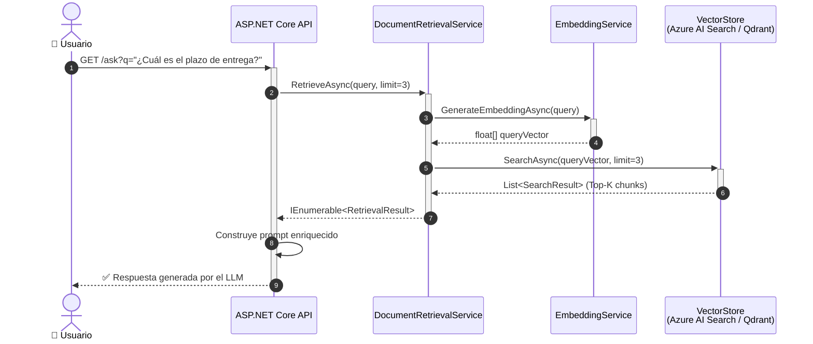

# 2.4 Construcción del sistema de recuperación (Retrieval)

En la arquitectura de Generación Aumentada por Recuperación (RAG), el sistema de recuperación (**Retrieval**) actúa como el puente crítico entre la consulta del usuario y el conocimiento externo que no reside en los pesos estáticos del modelo de lenguaje. En esta sección, exploraremos cómo diseñar e implementar la lógica de recuperación dentro de una solución .NET, asegurando que sea escalable y eficiente.

### El Rol del Motor de Recuperación

El objetivo fundamental del sistema de recuperación es identificar, de entre miles o millones de fragmentos de texto (denominados *chunks*), aquellos que son semánticamente más relevantes para responder a la consulta del usuario. A diferencia de las búsquedas tradicionales basadas en palabras clave (búsqueda léxica), el motor de recuperación en RAG utiliza **búsqueda semántica**, lo que le permite entender el contexto y la intención, incluso si los términos exactos no coinciden.

### El Flujo de Trabajo del Retrieval en .NET

Un sistema de recuperación robusto en C# suele seguir un flujo de ejecución lineal dentro del pipeline:

1.  **Recepción de la consulta:** Se recibe el *prompt* o pregunta del usuario.
2.  **Vectorización de la consulta (Embedding):** Se convierte la pregunta en un vector numérico (este proceso se detallará en la sección 2.5).
3.  **Búsqueda de Similitud:** Se compara el vector de la consulta contra el almacén de vectores (Vector Store).
4.  **Filtrado y Ranking:** Se seleccionan los *N* resultados más cercanos (Top-K) según una métrica de distancia (comúnmente la similitud de coseno).
5.  **Construcción del contexto:** Se extrae el texto plano de esos fragmentos para inyectarlos en el prompt final.



### Abstracción del Servicio de Recuperación

Para mantener una arquitectura limpia y siguiendo los principios de SOLID, es fundamental abstraer la lógica de recuperación mediante interfaces. Esto permite que nuestra aplicación sea agnóstica a la base de datos vectorial específica que elijamos más adelante (Azure AI Search, Qdrant, Milvus, etc.).

He aquí un ejemplo de cómo definir esta abstracción en .NET:

```csharp
public record RetrievalResult(string Content, string SourceMetadata, float ConfidenceScore);

public interface IRetrievalService
{
    /// <summary>
    /// Recupera los fragmentos más relevantes basados en una consulta de lenguaje natural.
    /// </summary>
    /// <param name="query">La pregunta del usuario.</param>
    /// <param name="limit">Número máximo de fragmentos a recuperar (Top-K).</param>
    /// <returns>Una lista de fragmentos con su metainformación.</returns>
    Task<IEnumerable<RetrievalResult>> RetrieveAsync(string query, int limit = 3);
}
```

### Implementación Lógica del Componente

Aunque la implementación específica dependerá del proveedor de búsqueda, la lógica de orquestación dentro de nuestro servicio en C# suele integrarse con el SDK de **Semantic Kernel** o directamente con clientes de bases de datos vectoriales.

A continuación, se muestra una implementación conceptual de un servicio que coordina la búsqueda:

```csharp
public class DocumentRetrievalService : IRetrievalService
{
    private readonly IEmbeddingGenerationService _embeddingService;
    private readonly IVectorStoreClient _vectorStoreClient;

    public DocumentRetrievalService(
        IEmbeddingGenerationService embeddingService, 
        IVectorStoreClient vectorStoreClient)
    {
        _embeddingService = embeddingService;
        _vectorStoreClient = vectorStoreClient;
    }

    public async Task<IEnumerable<RetrievalResult>> RetrieveAsync(string query, int limit = 3)
    {
        // 1. Generar el embedding para la consulta actual
        var queryVector = await _embeddingService.GenerateEmbeddingAsync(query);

        // 2. Ejecutar la búsqueda en la base de datos vectorial
        // El método SearchAsync encapsula la lógica de similitud de coseno
        var searchResults = await _vectorStoreClient.SearchAsync(queryVector, limit);

        // 3. Mapear y retornar resultados
        return searchResults.Select(r => new RetrievalResult(
            Content: r.Text,
            SourceMetadata: r.DocumentName,
            ConfidenceScore: r.Score
        ));
    }
}
```

### Consideraciones sobre el "Top-K" y el Umbral de Similitud

Al construir el sistema de recuperación, dos parámetros definen la calidad de la respuesta generada posteriormente:

1.  **Top-K (limit):** Es la cantidad de fragmentos que enviaremos al LLM. Si es demasiado bajo, el modelo puede carecer de información suficiente. Si es demasiado alto, corremos el riesgo de exceder la ventana de contexto del modelo o introducir información ruidosa que lo confunda.
2.  **Umbral de Similitud (Similarity Threshold):** No todos los resultados devueltos por una base de datos vectorial son necesariamente útiles. Es una buena práctica en .NET implementar filtros de confianza para descartar fragmentos cuya puntuación de similitud sea inferior a un valor determinado (por ejemplo, < 0.7), evitando así que el LLM intente responder basándose en información irrelevante.

### Integración con Semantic Kernel

Si estás utilizando **Microsoft Semantic Kernel**, el sistema de recuperación se facilita enormemente a través del componente `IMemoryStore`. Semantic Kernel permite registrar "memorias" y buscarlas de forma nativa:

```csharp
// Ejemplo simplificado usando Semantic Kernel para recuperación
var kernelMemory = new MemoryBuilder()
    .WithTextEmbeddingGeneration(new AzureOpenAITextEmbeddingGenerationService(...))
    .WithMemoryStore(new VolatileMemoryStore()) // O cualquier conector como Qdrant/AzureAISearch
    .Build();

// Recuperación semántica directa
var memories = kernelMemory.SearchAsync("collection-name", "Explícame el proceso de facturación", limit: 3);

await foreach (var memory in memories)
{
    Console.WriteLine($"Fragmento recuperado: {memory.Metadata.Text}");
}
```

Este enfoque de "construcción del sistema de recuperación" sienta las bases para lo que veremos en el punto **2.5**, donde profundizaremos en los modelos de embeddings específicos y las bases de datos vectoriales que mejor se integran con el ecosistema de .NET.