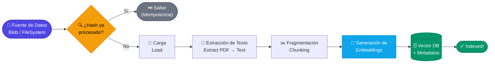

# 2.6 Pipeline de ingesta de datos en RAG

## 2.6 Pipeline de ingesta de datos en RAG

El **Pipeline de Ingesta de Datos** es el proceso fundamental de "ETL" (Extracción, Transformación y Carga) adaptado para el mundo de la Inteligencia Artificial Generativa. En un sistema RAG, la calidad de la respuesta del modelo es directamente proporcional a la calidad de los datos ingeridos. Si el sistema de recuperación no puede encontrar la información relevante debido a una mala ingesta, el LLM, por potente que sea, no podrá generar una respuesta precisa.

Mientras que en las secciones anteriores (2.4 y 2.5) hemos explorado los componentes individuales como los sistemas de recuperación y las bases de datos vectoriales, el pipeline de ingesta es el **orquestador** que asegura que los documentos (en este caso, PDFs) se conviertan en una representación matemática que la máquina pueda "entender" y recuperar eficientemente.

### El flujo de trabajo de la ingesta

Un pipeline de ingesta estándar en .NET se compone de las siguientes etapas secuenciales:

1.  **Carga de Documentos (Load):** Acceso a la fuente de datos (Azure Blob Storage, sistema de archivos local, base de datos).
2.  **Extracción de Texto (Extract):** Conversión del formato binario del PDF a texto plano o estructurado (Markdown/JSON).
3.  **Fragmentación (Chunking):** División del texto en fragmentos manejables para respetar los límites de tokens de los modelos de embeddings y del LLM.
4.  **Generación de Embeddings (Embed):** Conversión de cada fragmento de texto en un vector numérico de alta dimensionalidad.
5.  **Almacenamiento e Indexación (Store):** Persistencia de los vectores y el texto original (junto con metadatos) en una base de datos vectorial.



### Orquestación en .NET

En aplicaciones empresariales con .NET, este pipeline suele implementarse siguiendo patrones de diseño que garanticen la escalabilidad y la tolerancia a fallos. No es recomendable procesar grandes volúmenes de PDFs de forma síncrona dentro de una solicitud HTTP; en su lugar, se utilizan **Worker Services** o **Azure Functions** para procesar la ingesta en segundo plano.

A continuación, se presenta un ejemplo conceptual de cómo se estructuraría un orquestador de ingesta en C# utilizando una arquitectura limpia:

```csharp
public class IngestionPipeline
{
    private readonly IPdfExtractor _extractor;
    private readonly ITextChunker _chunker;
    private readonly IEmbeddingService _embeddingService;
    private readonly IVectorDatabase _vectorDb;

    public IngestionPipeline(
        IPdfExtractor extractor, 
        ITextChunker chunker, 
        IEmbeddingService embeddingService, 
        IVectorDatabase vectorDb)
    {
        _extractor = extractor;
        _chunker = chunker;
        _embeddingService = embeddingService;
        _vectorDb = vectorDb;
    }

    public async Task ProcessDocumentAsync(Stream pdfStream, string documentId)
    {
        // 1. Extracción (Se detallará en 3.1)
        string rawText = await _extractor.ExtractTextAsync(pdfStream);

        // 2. Fragmentación (Se detallará en 3.2)
        var chunks = _chunker.SplitIntoChunks(rawText, chunkSize: 512);

        var entriesToStore = new List<VectorRecord>();

        foreach (var chunk in chunks)
        {
            // 3. Generación de Embeddings
            float[] vector = await _embeddingService.GenerateEmbeddingAsync(chunk);

            // 4. Preparación de metadatos (Crucial para el filtrado posterior)
            entriesToStore.Add(new VectorRecord
            {
                Id = Guid.NewGuid().ToString(),
                Vector = vector,
                Text = chunk,
                Metadata = new Dictionary<string, string> 
                { 
                    { "source", documentId },
                    { "ingested_at", DateTime.UtcNow.ToString("O") }
                }
            });
        }

        // 5. Carga masiva en la base de datos vectorial
        await _vectorDb.UpsertRecordsAsync(entriesToStore);
    }
}
```

### Componentes clave del Pipeline

#### Gestión de Metadatos
No basta con almacenar el vector y el texto. Un pipeline robusto debe inyectar **metadatos** (como el nombre del archivo, el número de página o el nivel de seguridad del documento). Esto permite que, durante la fase de recuperación, podamos aplicar filtros granulares (por ejemplo: *"Busca solo en documentos del departamento de RRHH publicados en 2023"*).

#### Idempotencia y Actualización
Un desafío común en la ingesta es evitar la duplicación de datos. El pipeline debe ser capaz de identificar si un documento ya ha sido procesado. Una técnica común en .NET es generar un hash (SHA-256) del contenido del archivo original. Antes de iniciar la ingesta, se comprueba si ese hash ya existe en la base de datos de metadatos.

#### Manejo de Errores y Reintentos
Dado que la generación de embeddings usualmente depende de APIs externas (como Azure OpenAI), el pipeline debe implementar políticas de reintento con *exponential backoff*, algo que en el ecosistema .NET se maneja de forma excelente mediante librerías como **Polly**.

### Consideraciones para el rendimiento
Para procesar miles de documentos, el pipeline debe aprovechar el paralelismo de .NET. El uso de `Task.WhenAll` o `Parallel.ForEachAsync` puede acelerar drásticamente la generación de embeddings, siempre y cuando se respeten los límites de tasa (Rate Limits) de la API de IA que se esté utilizando.

---
*Nota: Los detalles específicos sobre las librerías de extracción de PDF (3.1) y las estrategias avanzadas de fragmentación (3.2) se abordarán en el siguiente capítulo para profundizar en la implementación técnica de cada paso.*