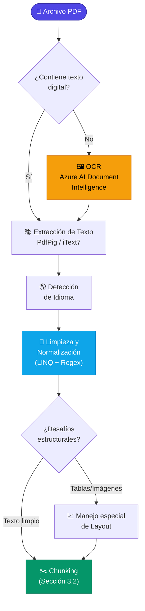

# 3.1.1 Extracción de texto de PDFs (Librerías C#: *UglyToad.PdfPig, iText7, PdfSharp*)

### 3.1.1 Extracción de texto de PDFs (Librerías C#: UglyToad.PdfPig, iText7, PdfSharp)

La extracción de texto es el primer paso crítico en el pipeline de ingesta de un sistema RAG. Si la extracción es deficiente o introduce "ruido" (caracteres mal codificados, pérdida de espacios, orden de lectura incorrecto), la calidad de los *embeddings* generados posteriormente se verá degradada, afectando directamente la precisión de la recuperación.



En el ecosistema .NET, existen varias librerías para abordar esta tarea. A continuación, analizamos las tres más relevantes para proyectos de IA y procesamiento de documentos.

---

#### 1. UglyToad.PdfPig
**PdfPig** es actualmente una de las opciones más populares en .NET para tareas de RAG debido a su licencia permisiva (MIT) y su capacidad para exponer metadatos detallados de cada elemento en el documento. A diferencia de otras librerías, PdfPig permite acceder no solo al texto, sino a la posición de las letras, fuentes y estructuras de las páginas.

**Ventajas:**
*   Excelente manejo de la geometría del documento (útil para identificar encabezados o pies de página que queramos excluir).
*   Código abierto y gratuito para uso comercial.
*   No requiere dependencias externas pesadas.

**Ejemplo de implementación:**

```csharp
using UglyToad.PdfPig;
using UglyToad.PdfPig.Content;

public string ExtractWithPdfPig(string filePath)
{
    using (PdfDocument document = PdfDocument.Open(filePath))
    {
        var textBuilder = new StringBuilder();
        foreach (Page page in document.GetPages())
        {
            // Extraer texto preservando un orden de lectura básico
            textBuilder.AppendLine(page.Text);
        }
        return textBuilder.ToString();
    }
}
```

---

#### 2. iText7 (anteriormente iTextSharp)
**iText7** es el estándar de la industria en cuanto a robustez y capacidades. Es una librería extremadamente potente que puede manejar archivos PDF con codificaciones complejas o estructuras internas no estándar que otras librerías podrían fallar en procesar.

**Consideración de Licencia:** Es importante notar que iText7 utiliza un modelo de licencia dual (AGPL/Comercial). Para proyectos comerciales cerrados, requiere el pago de una licencia.

**Estrategias de Extracción:**
iText7 permite definir "estrategias" para decidir cómo se debe interpretar el flujo de texto (por ejemplo, manteniendo el orden de las columnas).

**Ejemplo de implementación:**

```csharp
using iText.Kernel.Pdf;
using iText.Kernel.Pdf.Canvas.Parser;
using iText.Kernel.Pdf.Canvas.Parser.Listener;

public string ExtractWithIText7(string filePath)
{
    using (PdfReader reader = new PdfReader(filePath))
    using (PdfDocument pdfDoc = new PdfDocument(reader))
    {
        var textBuilder = new StringBuilder();
        for (int i = 1; i <= pdfDoc.GetNumberOfPages(); i++)
        {
            // LocationTextExtractionStrategy intenta preservar la disposición visual
            ITextExtractionStrategy strategy = new LocationTextExtractionStrategy();
            string pageText = PdfTextExtractor.GetTextFromPage(pdfDoc.GetPage(i), strategy);
            textBuilder.AppendLine(pageText);
        }
        return textBuilder.ToString();
    }
}
```

---

#### 3. PdfSharp
Aunque **PdfSharp** es una librería muy extendida en el ecosistema .NET, es fundamental entender su rol. Su diseño principal está orientado a la **creación** y **modificación** de documentos, no necesariamente a la extracción de contenido.

**Limitaciones para RAG:**
PdfSharp no incluye de forma nativa un motor de extracción de texto de alto nivel que maneje la reconstrucción de palabras a partir de glifos o el orden de lectura. Para extraer texto con PdfSharp, a menudo se requiere iterar manualmente sobre los flujos de contenido (*content streams*) del PDF, lo cual es propenso a errores en documentos complejos.

*Recomendación:* Utilizar PdfSharp solo si ya forma parte de su stack tecnológico para edición y el documento tiene una estructura de texto muy simple. Para RAG avanzado, PdfPig o iText7 son opciones superiores.

---

#### Criterios de Selección para el Pipeline RAG

Para decidir qué librería integrar en su sistema de procesamiento de documentos, considere los siguientes factores:

| Característica | UglyToad.PdfPig | iText7 | PdfSharp |
| :--- | :--- | :--- | :--- |
| **Licencia** | MIT (Gratuita) | AGPL / Comercial | MIT (Gratuita) |
| **Extracción de Texto** | Alta fidelidad | Muy alta (configurable) | Limitada / Manual |
| **Complejidad de uso** | Baja | Media | Media |
| **Uso ideal en RAG** | Aplicaciones estándar y análisis de layout | Documentos empresariales complejos | Creación de PDFs auxiliares |

#### La importancia del "Texto Limpio"
Independientemente de la librería elegida, la extracción es solo el inicio. Como veremos en las secciones **3.1.3 (Limpieza)** y **3.1.6 (Desafíos estructurales)**, el texto extraído suele contener saltos de línea innecesarios, caracteres especiales de ligaduras de fuentes o artefactos de numeración de páginas. 

En un flujo RAG, el objetivo de esta etapa es obtener un *string* lo más fiel posible al contenido semántico del autor, eliminando el ruido visual que no aporta valor al modelo de lenguaje (LLM). Si el PDF contiene principalmente imágenes de texto, estas librerías devolverán un resultado vacío, lo que nos obligará a recurrir a técnicas de OCR detalladas en la sección 3.1.5.