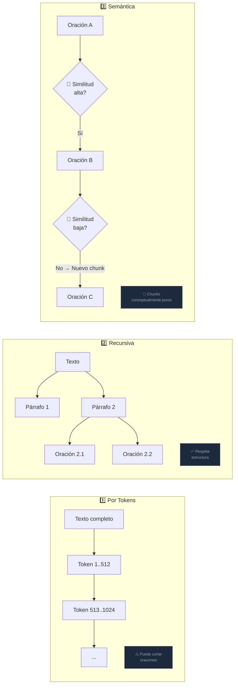

# 3.2.2 Implementación de estrategias de fragmentación en C#: Recursiva, Semántica y basada en tokens (*usando Microsoft.ML.Tokenizers*)

Una vez que hemos extraído y normalizado el texto de nuestros documentos PDF (como se vio en la sección 3.1), el siguiente desafío crítico es cómo dividir ese texto en fragmentos o *chunks* manejables. No basta con cortar el texto arbitrariamente; la estrategia de fragmentación determina qué tan relevante será la información recuperada por el motor de búsqueda vectorial.

En esta sección, exploraremos tres estrategias fundamentales implementadas en C# para optimizar nuestro pipeline de RAG.

---

### 1. Fragmentación basada en Tokens (Token-based Chunking)

A diferencia de los humanos, los LLMs no "leen" palabras, sino **tokens**. Un token puede ser una palabra, parte de una palabra o incluso un signo de puntuación. Dado que los modelos de embeddings y los LLMs tienen límites estrictos de contexto expresados en tokens, esta es la forma más precisa de garantizar que un fragmento no exceda la capacidad del modelo.

Para implementar esto en .NET, utilizamos la librería oficial **Microsoft.ML.Tokenizers**, que es altamente eficiente y compatible con las codificaciones de OpenAI (como `cl100k_base`).

#### Ejemplo de implementación con `Microsoft.ML.Tokenizers`:

```csharp
using Microsoft.ML.Tokenizers;

public class TokenChunker
{
    private readonly Tokenizer _tokenizer;

    public TokenChunker(string modelName = "gpt-4o")
    {
        // Inicializamos el tokenizer adecuado para el modelo
        _tokenizer = Tokenizer.CreateTiktokenForModel(modelName);
    }

    public List<string> SplitByTokens(string text, int maxTokensPerChunk, int overlapTokens)
    {
        var chunks = new List<string>();
        var encoding = _tokenizer.Encode(text);
        var tokens = encoding.Tokens;

        int start = 0;
        while (start < tokens.Count)
        {
            int end = Math.Min(start + maxTokensPerChunk, tokens.Count);
            var chunkTokens = tokens.Take(start..end).ToArray();
            
            // Decodificamos de nuevo a texto
            chunks.Add(_tokenizer.Decode(chunkTokens));

            if (end == tokens.Count) break;

            // Avanzamos restando el solapamiento (overlap) para mantener contexto
            start += (maxTokensPerChunk - overlapTokens);
        }

        return chunks;
    }
}
```

*   **Ventaja:** Control absoluto sobre los límites del modelo.
*   **Desventaja:** Puede cortar oraciones a la mitad, perdiendo coherencia gramatical.

---

### 2. Fragmentación Recursiva por Caracteres (Recursive Character Splitting)

Es la técnica estándar para equilibrar la estructura del documento con el tamaño del fragmento. En lugar de cortar cada $N$ caracteres de forma rígida, esta estrategia intenta dividir el texto utilizando una jerarquía de separadores (párrafos, luego oraciones, luego palabras).

El objetivo es mantener el contenido relacionado semánticamente en el mismo fragmento el mayor tiempo posible.

#### Lógica de implementación en C#:

```csharp
public class RecursiveCharacterChunker
{
    private readonly string[] _separators = { "\n\n", "\n", ". ", " ", "" };

    public List<string> SplitText(string text, int maxChars, int overlap)
    {
        return RecursiveSplit(text, _separators, maxChars, overlap);
    }

    private List<string> RecursiveSplit(string text, string[] separators, int maxChars, int overlap)
    {
        if (text.Length <= maxChars) return new List<string> { text };

        string separator = separators.Last();
        foreach (var s in separators)
        {
            if (text.Contains(s))
            {
                separator = s;
                break;
            }
        }

        var splits = text.Split(separator);
        var chunks = new List<string>();
        var currentChunk = new StringBuilder();

        foreach (var part in splits)
        {
            if (currentChunk.Length + part.Length > maxChars)
            {
                chunks.Add(currentChunk.ToString().Trim());
                // Lógica de solapamiento simplificada
                currentChunk.Clear(); 
            }
            currentChunk.Append(part + separator);
        }
        
        if (currentChunk.Length > 0) chunks.Add(currentChunk.ToString().Trim());
        return chunks;
    }
}
```

*   **Ventaja:** Respeta la estructura natural del documento (evita romper párrafos).
*   **Uso recomendado:** Documentos técnicos y manuales donde la estructura de párrafos es vital.

---

### 3. Fragmentación Semántica (Semantic Chunking)

Esta es la técnica más avanzada. En lugar de basarse en reglas sintácticas o conteo de caracteres, la fragmentación semántica analiza el significado del texto.

**El proceso funciona de la siguiente manera:**
1.  Se divide el documento en oraciones individuales.
2.  Se generan embeddings para cada oración (usando por ejemplo `Azure.AI.OpenAI`).
3.  Se calcula la **similitud de coseno** entre oraciones adyacentes.
4.  Si la similitud cae por debajo de un umbral (threshold), se identifica un "punto de ruptura" y se comienza un nuevo fragmento.

#### Implementación conceptual en .NET:

Aunque requiere una llamada a un modelo de embeddings, la lógica central en C# utiliza el producto escalar de vectores:

```csharp
public async Task<List<string>> CreateSemanticChunks(string[] sentences, double threshold)
{
    var chunks = new List<string>();
    var currentChunk = sentences[0];

    for (int i = 0; i < sentences.Length - 1; i++)
    {
        // Supongamos GetEmbedding es un método que llama a OpenAI
        float[] vectorA = await GetEmbedding(sentences[i]);
        float[] vectorB = await GetEmbedding(sentences[i + 1]);

        double similarity = CosineSimilarity(vectorA, vectorB);

        if (similarity > threshold)
        {
            currentChunk += " " + sentences[i + 1];
        }
        else
        {
            chunks.Add(currentChunk);
            currentChunk = sentences[i + 1];
        }
    }
    chunks.Add(currentChunk);
    return chunks;
}
```

*   **Ventaja:** Los fragmentos son conceptualmente puros; cada uno trata sobre un solo tema.
*   **Desventaja:** Mayor costo computacional y latencia debido a la generación masiva de embeddings durante la ingesta.

---

### Comparativa y Selección de Estrategia



| Estrategia | Ideal para... | Complejidad C# | Precisión RAG |
| :--- | :--- | :--- | :--- |
| **Tokens** | Control de costes y límites de LLM | Baja | Media |
| **Recursiva** | Documentos con estructura clara | Media | Alta |
| **Semántica** | Temas que cambian rápidamente en el texto | Alta | Muy Alta |

En aplicaciones empresariales con .NET, una práctica común es utilizar la **Fragmentación Recursiva** como base, pero validando el tamaño final mediante el **Tokenizer** de Microsoft para asegurar que el fragmento resultante sea compatible con el modelo de generación que utilizaremos en el capítulo 3.3.

A continuación, en la sección 3.2.3, veremos cómo enriquecer estos fragmentos mediante el uso de metadatos, lo cual permitirá filtrados mucho más potentes en la base de datos vectorial.