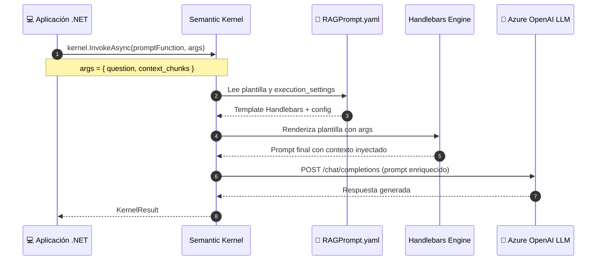

# 3.3.1 Ingeniería de Prompts estructurada usando *Semantic Kernel Prompts* (Handlebars, YAML)

En la arquitectura de una aplicación RAG, tras haber recuperado los fragmentos de texto más relevantes de nuestra base de datos vectorial (fase de *Retrieval*), entramos en la fase de **Generación**. Aquí, la calidad de la respuesta final depende enteramente de cómo presentemos la información al LLM. El uso de **Semantic Kernel** nos permite alejarnos de la concatenación manual de cadenas de texto y adoptar un enfoque de ingeniería de prompts estructurado, mantenible y profesional mediante el uso de plantillas en formatos **YAML** y **Handlebars**.

### El paso de Prompts "Hardcoded" a Prompts Estructurados

En implementaciones iniciales, es común ver prompts construidos mediante interpolación de hilos en C#. Sin embargo, esto dificulta la iteración, las pruebas y la colaboración con ingenieros de prompts. Semantic Kernel soluciona esto permitiendo definir el comportamiento del modelo, las restricciones y las variables de entrada en archivos externos.

### 1. Definición de Prompts mediante YAML

El formato YAML es el estándar recomendado en Semantic Kernel para definir prompts, ya que permite encapsular en un solo lugar tanto el texto de la instrucción como la configuración del modelo (hiperparámetros).

Un archivo de configuración de prompt típico (`skprompt.yaml`) para nuestro sistema RAG tendría la siguiente estructura:

```yaml
name: RespuestaSobreDocumentos
description: Genera una respuesta basada estrictamente en el contexto recuperado de un PDF.
template_format: semantic-kernel # O 'handlebars'
template: |
  <message role="system">
    Eres un asistente experto encargado de responder preguntas basadas en la documentación técnica proporcionada.
    Utiliza únicamente los fragmentos de texto entregados para construir tu respuesta. 
    Si la información no se encuentra en el contexto, indica amablemente que no tienes suficiente información.
  </message>
  <message role="user">
    Pregunta del usuario: {{question}}

    Contexto recuperado:
    {{context}}
  </message>
execution_settings:
  default:
    max_tokens: 500
    temperature: 0.1
    top_p: 0.9
input_variables:
  - name: question
    description: La duda planteada por el usuario.
    is_required: true
  - name: context
    description: Los fragmentos de texto recuperados del PDF.
    is_required: true
```

### 2. Uso de Plantillas Handlebars para Lógica Compleja

Cuando el Pipeline de RAG se vuelve más complejo —por ejemplo, si queremos iterar sobre una lista de documentos, aplicar lógica condicional o formatear metadatos— el motor de plantillas **Handlebars** es superior al sistema de reemplazo simple.

Para usar Handlebars, debemos registrarlo en el Kernel y cambiar el `template_format` en nuestro YAML. Esto nos permite hacer lo siguiente en la plantilla:

```handlebars
<message role="user">
  Basándote en los siguientes fragmentos extraídos del PDF, responde a la pregunta: {{question}}

  Contexto:
  {{#each context_chunks}}
    ---
    Fragmento ID: {{this.Id}}
    Contenido: {{this.Text}}
    Página: {{this.PageNumber}}
  {{/each}}
</message>
```

Esta estructura permite al modelo no solo responder, sino también citar fuentes (ej. "Como se menciona en la página 5...") de forma más precisa.

### 3. Implementación en C# con Semantic Kernel

Una vez definido el prompt estructurado, su integración en nuestro servicio de .NET es directa. Semantic Kernel se encarga de parsear el YAML e inyectar las variables de los resultados obtenidos en las fases previas (Sección 3.2).

```csharp
using Microsoft.SemanticKernel;
using Microsoft.SemanticKernel.PromptTemplates.Handlebars;

// 1. Configurar el Kernel con el motor de Handlebars
var builder = Kernel.CreateBuilder();
builder.AddAzureOpenAIChatCompletion("deployment-name", "endpoint", "api-key");
var kernel = builder.Build();

// 2. Cargar el prompt desde el archivo YAML
string yamlContent = File.ReadAllText("Prompts/RAGPrompt.yaml");
var promptFunction = kernel.CreateFunctionFromPromptYaml(
    yamlContent, 
    new HandlebarsPromptTemplateFactory()
);

// 3. Preparar los argumentos (Contexto recuperado + Pregunta)
// Supongamos que 'retrievedChunks' viene de nuestra Vector DB (Sección 2.5)
var arguments = new KernelArguments
{
    { "question", "¿Cuál es el periodo de garantía según el manual?" },
    { "context", string.Join("\n", retrievedChunks.Select(c => c.Text)) }
};

// 4. Ejecutar la generación
var result = await kernel.InvokeAsync(promptFunction, arguments);

Console.WriteLine(result.ToString());
```

### Ventajas de este enfoque en el Pipeline RAG

1.  **Separación de Preocupaciones:** El código C# se encarga de la lógica de negocio y la recuperación de datos, mientras que el archivo YAML se encarga exclusivamente de la interacción con el LLM.
2.  **Control de Versiones:** Los cambios en las instrucciones del sistema o en la temperatura del modelo pueden rastrearse en Git de forma independiente al código compilado.
3.  **Tipado de Parámetros:** Al definir `input_variables` en el YAML, Semantic Kernel permite validar que todos los datos necesarios para la generación (como el contexto recuperado) estén presentes antes de realizar la llamada a la API, ahorrando costos por llamadas fallidas.

Este método de ingeniería de prompts estructurada prepara el terreno para la **integración del SDK de Azure OpenAI** (tema 3.3.2), donde exploraremos cómo estas plantillas se traducen en llamadas eficientes a los modelos GPT-4 o GPT-3.5 de manera optimizada.

---

### Flujo de Inyección de Contexto con Semantic Kernel

