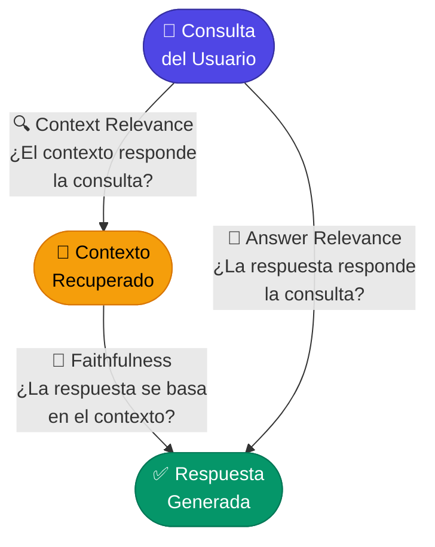

# 3.4.1 Métricas clave: Relevancia del contexto y Fidelidad de la respuesta

Tras haber implementado los componentes de ingesta, fragmentación (chunking) y generación, surge la pregunta crítica: **¿Qué tan bueno es nuestro sistema RAG?** Evaluar una aplicación de IA generativa no es tan sencillo como realizar pruebas unitarias tradicionales, ya que las respuestas son probabilísticas.

Para medir la calidad de un pipeline RAG básico, nos centramos en dos de las métricas fundamentales del paradigma "RAG Triad": la **Relevancia del Contexto** y la **Fidelidad de la Respuesta**.



---

### 1. Relevancia del Contexto (Context Relevance)

Esta métrica evalúa la calidad del componente de **Recuperación (Retrieval)**. Su objetivo es determinar si los fragmentos de texto (chunks) recuperados de la base de datos vectorial contienen realmente la información necesaria para responder a la consulta del usuario.

*   **El problema:** Si el sistema recupera información irrelevante o "ruido", el LLM puede confundirse, omitir detalles importantes o consumir tokens innecesariamente.
*   **Qué mide:** La proporción de información útil dentro de los resultados recuperados frente a la consulta original.

#### Implementación conceptual en .NET
Para medir esto de forma automatizada, solemos utilizar un enfoque de **LLM-as-a-judge**. Le pedimos a un modelo más potente (como GPT-4o) que actúe como evaluador.

```csharp
// Ejemplo de prompt para evaluar Relevancia del Contexto usando Semantic Kernel
string contextRelevancePrompt = @"
Dada la siguiente consulta del usuario y los fragmentos de contexto recuperados, 
evalúa si el contexto es suficiente y relevante para responder a la consulta.

Consulta: {{$query}}
Contexto Recuperado: {{$context}}

Proporciona una puntuación de 0.0 a 1.0, donde:
- 1.0: El contexto contiene la respuesta exacta o información directamente relacionada.
- 0.0: El contexto no tiene nada que ver con la consulta.

Devuelve únicamente el número.";

// Lógica de evaluación
var evaluationResult = await kernel.InvokePromptAsync(contextRelevancePrompt, new() {
    { "query", userQuery },
    { "context", retrievedChunksText }
});
```

---

### 2. Fidelidad de la Respuesta (Faithfulness / Groundedness)

Esta métrica evalúa la calidad del componente de **Generación**. También conocida como *Groundedness*, mide si la respuesta generada por el modelo se basa **exclusivamente** en el contexto proporcionado, evitando alucinaciones.

*   **El problema:** El LLM puede responder correctamente basándose en su conocimiento previo (entrenamiento), pero si la información no está en los PDFs proporcionados, el sistema está fallando como arquitectura RAG.
*   **Qué mide:** La veracidad de las afirmaciones de la respuesta con respecto al contexto recuperado.

#### Ejemplo de validación técnica
Para calcular la fidelidad, el proceso suele dividirse en dos pasos:
1.  Identificar las afirmaciones (claims) individuales en la respuesta generada.
2.  Verificar si cada afirmación está respaldada por el contexto recuperado.

```csharp
// Estructura de datos para el resultado de la evaluación
public record EvaluationScore(float Score, string Reasoning);

public async Task<EvaluationScore> EvaluateFaithfulness(string context, string answer)
{
    var prompt = $@"
    Analiza la veracidad de la 'Respuesta' basándote estrictamente en el 'Contexto'.
    
    Contexto: {context}
    Respuesta: {answer}

    ¿Cada parte de la respuesta está respaldada por el contexto? 
    Responde en formato JSON: {{ ""score"": 0.0-1.0, ""reasoning"": ""explicación breve"" }}";

    var response = await kernel.InvokePromptAsync(prompt);
    return JsonSerializer.Deserialize<EvaluationScore>(response.ToString());
}
```

---

### Diferencias Clave y su Impacto en el Desarrollo

| Métrica | Componente Evaluado | Si la puntuación es baja... |
| :--- | :--- | :--- |
| **Relevancia del Contexto** | Retrieval (Búsqueda Vectorial) | Debes mejorar el *embedding model*, ajustar el tamaño de los *chunks* (3.2.1) o implementar Búsqueda Híbrida (4.5). |
| **Fidelidad (Faithfulness)** | Generation (LLM) | Debes ajustar el *System Prompt* (3.3.1), reducir la temperatura del modelo o mejorar las instrucciones de "responde solo basándote en el contexto". |

### Por qué son vitales antes de pasar al RAG Avanzado

En esta etapa del curso (RAG Básico), estas métricas sirven como **línea base (baseline)**. Es imposible saber si las técnicas avanzadas que veremos en el Capítulo 4 (como el *Re-ranking* o el *Parent Document Retriever*) realmente aportan valor si no tenemos una medición cuantitativa de nuestro sistema actual.

En aplicaciones empresariales con .NET, estas métricas no solo se calculan durante el desarrollo, sino que a menudo se integran en procesos de telemetría para detectar cuando el sistema comienza a alucinar o cuando la base de conocimientos (los PDFs) no es suficiente para cubrir las dudas de los usuarios.