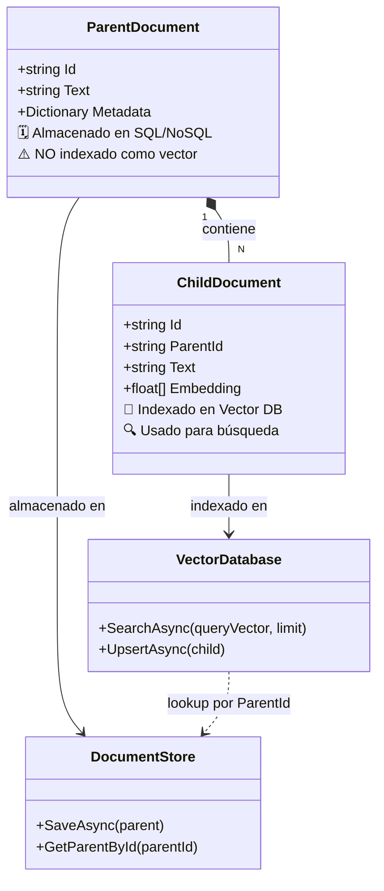

# 4.3.1 Técnica del Documento Padre (*Parent Document Retriever*) implementada en C#

En el desarrollo de sistemas RAG avanzados, nos enfrentamos a un dilema fundamental: los fragmentos (chunks) pequeños son excelentes para que los modelos de embeddings capturen significados semánticos precisos, pero a menudo carecen del contexto necesario para que el LLM genere una respuesta completa y coherente. Por el contrario, los fragmentos grandes conservan el contexto, pero diluyen la señal semántica, dificultando la recuperación precisa.

La **Técnica del Documento Padre (Parent Document Retriever)** resuelve este conflicto separando los fragmentos utilizados para la búsqueda vectorial de los fragmentos que se entregan al LLM.

### El Concepto: Padre vs. Hijo

En lugar de indexar un único nivel de fragmentación, implementamos una jerarquía:

1.  **Documentos Padres:** Fragmentos de mayor tamaño (ej. 1000-2000 tokens) que contienen el contexto completo de una sección o párrafo extenso.
2.  **Documentos Hijos:** Sub-fragmentos de los padres (ej. 200-400 tokens) que se solapan entre sí. Estos son los que se convierten en vectores (embeddings).

Cuando realizamos una consulta, el sistema busca los **Documentos Hijos** más similares, pero en lugar de enviar esos fragmentos cortos al LLM, recupera el **Documento Padre** asociado para proporcionar una ventana de contexto mucho más rica.



### Implementación en C# con .NET

Para implementar esto, necesitamos una estructura de datos que relacione ambos niveles y un almacén de vectores que soporte metadatos. En este ejemplo, utilizaremos una aproximación genérica que podrías adaptar a **Semantic Kernel** o al SDK de **Azure AI Search**.

#### 1. Definición de Modelos

Primero, definimos cómo representaremos nuestra jerarquía en C#:

```csharp
public class ParentDocument
{
    public string Id { get; set; } = Guid.NewGuid().ToString();
    public string Text { get; set; }
    public Dictionary<string, object> Metadata { get; set; } = new();
}

public class ChildDocument
{
    public string Id { get; set; } = Guid.NewGuid().ToString();
    public string ParentId { get; set; } // Referencia al ID del Padre
    public string Text { get; set; }
    public float[]? Embedding { get; set; }
}
```

#### 2. Lógica de Indexación

La clave aquí es procesar el PDF (usando librerías mencionadas en el punto 3.1 como *PdfPig*) y realizar una doble fragmentación.

```csharp
public class ParentChildIndexer
{
    public async Task IndexDocument(string fullText)
    {
        // 1. Crear fragmentos grandes (Padres)
        var parentChunks = TextChunker.SplitPlainTextLines(fullText, maxTokensPerLine: 1000);
        
        foreach (var pText in parentChunks)
        {
            var parent = new ParentDocument { Text = pText };
            await SaveToStore(parent); // Almacén de documentos persistente (SQL, NoSQL, Blob)

            // 2. Crear fragmentos pequeños (Hijos) a partir del Padre
            var childChunks = TextChunker.SplitPlainTextLines(pText, maxTokensPerLine: 200);
            
            foreach (var cText in childChunks)
            {
                var child = new ChildDocument 
                { 
                    ParentId = parent.Id, 
                    Text = cText,
                    Embedding = await _embeddingGenerator.GenerateEmbeddingAsync(cText)
                };
                await _vectorDatabase.UpsertAsync(child); // Solo el Hijo va a la base vectorial
            }
        }
    }
}
```
*Nota: `TextChunker` es una utilidad disponible en el paquete `Microsoft.SemanticKernel.Text`.*

#### 3. Recuperación Jerárquica

En el momento de la consulta, el flujo de trabajo cambia de una búsqueda simple a una recuperación de dos pasos:

```csharp
public async Task<string> RetrieveContext(string query)
{
    var queryEmbedding = await _embeddingGenerator.GenerateEmbeddingAsync(query);
    
    // 1. Buscar los fragmentos HIJOS más similares
    var topChildren = await _vectorDatabase.SearchAsync(queryEmbedding, limit: 5);

    // 2. Identificar IDs de Padres únicos para evitar duplicidad
    var parentIds = topChildren
        .Select(c => c.ParentId)
        .Distinct();

    // 3. Recuperar el contenido completo de los Documentos PADRES
    var contextBuilder = new StringBuilder();
    foreach (var pid in parentIds)
    {
        var parent = await _documentStore.GetParentById(pid);
        contextBuilder.AppendLine(parent.Text);
    }

    return contextBuilder.ToString();
}
```

### Ventajas de este enfoque en .NET

1.  **Precisión Semántica:** Al usar fragmentos pequeños para la búsqueda, evitas el "ruido" que generan los documentos largos en los modelos de embeddings.
2.  **Continuidad de la Respuesta:** El LLM recibe párrafos completos o secciones coherentes, lo que reduce drásticamente las alucinaciones causadas por frases cortadas o falta de contexto (problema común en el chunking básico visto en la sección 3.2).
3.  **Eficiencia de Almacenamiento:** Solo necesitas calcular y almacenar los vectores de los fragmentos hijos, mientras que los padres pueden residir en un almacenamiento de menor costo (como Azure Table Storage o PostgreSQL sin necesidad de `pgvector` para los padres).

### Casos de Uso Críticos

Esta técnica es especialmente útil cuando:
*   Los PDFs contienen **cláusulas legales** donde una oración corta depende enteramente del párrafo anterior.
*   Documentación técnica donde un **paso de configuración** solo tiene sentido si se lee junto con el encabezado de la sección.
*   Reportes financieros donde los datos en tablas necesitan la narrativa circundante para ser interpretados correctamente (complementando lo que veremos en la sección 3.1.6 sobre desafíos estructurales).

Al implementar el *Parent Document Retriever*, elevamos la arquitectura RAG de un simple buscador de coincidencias a un sistema capaz de comprender la estructura lógica de la información.