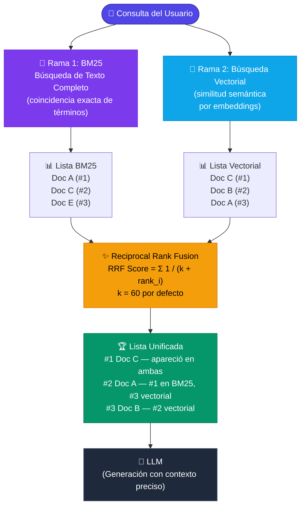

# 4.5.1 Búsqueda de texto completo (BM25) combinada con Búsqueda Vectorial (*Ejemplo con Azure AI Search Hybrid Query*)

### 4.5.1 Búsqueda de texto completo (BM25) combinada con Búsqueda Vectorial (Ejemplo con Azure AI Search Hybrid Query)

En las secciones anteriores, hemos explorado cómo la búsqueda vectorial permite capturar la intención semántica de una consulta. Sin embargo, la búsqueda vectorial no es una solución universal. Existen escenarios donde la precisión de las palabras clave exactas es superior, como al buscar números de piezas, nombres propios técnicos o acrónimos específicos. Aquí es donde entra en juego la **Búsqueda Híbrida**.

#### ¿Qué es la Búsqueda Híbrida?

La búsqueda híbrida combina dos metodologías de recuperación en una sola consulta:

1.  **Búsqueda de Texto Completo (BM25):** Utiliza el algoritmo *Best Matching 25*, una evolución de TF-IDF. Evalúa la relevancia basándose en la frecuencia de los términos, la saturación de los mismos y la longitud del documento. Es excelente para coincidencias exactas y terminología específica.
2.  **Búsqueda Vectorial:** Utiliza representaciones matemáticas (embeddings) para encontrar documentos que sean semánticamente similares a la consulta, incluso si no comparten palabras comunes.

#### La importancia de RRF (Reciprocal Rank Fusion)

Cuando ejecutamos una búsqueda híbrida en **Azure AI Search**, el motor recibe dos listas de resultados con escalas de puntuación completamente diferentes (puntuaciones BM25 vs. distancias de coseno/similitud de punto). Para unificar estos resultados, Azure utiliza un método llamado **Reciprocal Rank Fusion (RRF)**.

RRF no suma las puntuaciones; en su lugar, asigna una puntuación basada en la *posición* que ocupa cada documento en ambas listas. Un documento que aparece en los primeros puestos tanto de la búsqueda vectorial como de la de texto tendrá una puntuación RRF significativamente más alta, priorizando así los resultados que satisfacen ambos criterios.



#### Implementación en C# con Azure AI Search

Para implementar este enfoque, utilizaremos el SDK de Azure para .NET (`Azure.Search.Documents`).

##### 1. Configuración del Índice
Primero, debemos asegurarnos de que nuestro índice en Azure AI Search tenga campos configurados tanto para búsqueda de texto (analizables) como para búsqueda vectorial (colecciones de números flotantes).

```csharp
public class DocumentoRAG
{
    [SimpleField(IsKey = true, IsFilterable = true)]
    public string Id { get; set; }

    [SearchableField(AnalyzerName = LexicalAnalyzerName.Values.EsLucene)]
    public string Contenido { get; set; } // Para BM25

    [SearchField(VectorSearchDimensions = 1536, VectorSearchProfileName = "my-vector-profile")]
    public ReadOnlyMemory<float> VectorContenido { get; set; } // Para Búsqueda Vectorial
}
```

##### 2. Ejecución de la Consulta Híbrida
En una aplicación .NET, la consulta híbrida se define proporcionando tanto una cadena de texto (parámetro `Search`) como una consulta vectorial dentro de las opciones de búsqueda.

```csharp
using Azure;
using Azure.Search.Documents;
using Azure.Search.Documents.Models;

public async Task<List<DocumentoRAG>> EjecutarBusquedaHibrida(string queryUsuario, ReadOnlyMemory<float> embeddingConsulta)
{
    var searchClient = new SearchClient(new Uri(endpoint), "idx-pdf-rag", new AzureKeyCredential(apiKey));

    var searchOptions = new SearchOptions
    {
        // 1. Configuración de la Búsqueda Vectorial
        VectorSearch = new VectorSearchOptions
        {
            Queries = { new VectorizedQuery(embeddingConsulta) { 
                Fields = { "VectorContenido" },
                KNearestNeighborsCount = 3 
            }}
        },
        // 2. Parámetros adicionales
        Size = 5,
        Select = { "Id", "Contenido" }
    };

    // 3. Ejecución: Al pasar el primer parámetro (queryUsuario), 
    // habilitamos automáticamente BM25 sobre los campos [SearchableField]
    SearchResults<DocumentoRAG> response = await searchClient.SearchAsync<DocumentoRAG>(
        queryUsuario, 
        searchOptions
    );

    List<DocumentoRAG> resultados = new();
    await foreach (SearchResult<DocumentoRAG> result in response.GetResultsAsync())
    {
        resultados.Add(result.Document);
        Console.WriteLine($"Score RRF: {result.Score} - Documento: {result.Document.Id}");
    }

    return resultados;
}
```

#### Ventajas en el Pipeline RAG

Implementar la búsqueda híbrida en nuestro pipeline de .NET ofrece beneficios críticos para la calidad de la generación:

*   **Robustez ante errores ortográficos:** La búsqueda vectorial puede mitigar errores de escritura del usuario que el motor BM25 podría ignorar.
*   **Precisión en dominios técnicos:** Si el usuario pregunta por un código de error específico (ej. "Error 0x8004"), BM25 lo encontrará inmediatamente, mientras que un modelo de embedding podría diluir ese código en un espacio latente de "problemas de software".
*   **Reducción de Alucinaciones:** Al proporcionar un contexto más preciso (gracias a RRF), el LLM tiene menos probabilidades de "inventar" respuestas basadas en fragmentos que solo son semánticamente similares pero no contienen el dato específico requerido.

Este método constituye el estándar de oro para la fase de recuperación en aplicaciones RAG empresariales antes de pasar a técnicas más costosas computacionalmente como la re-clasificación (*Re-ranking*), que se tratará en la sección 4.9.