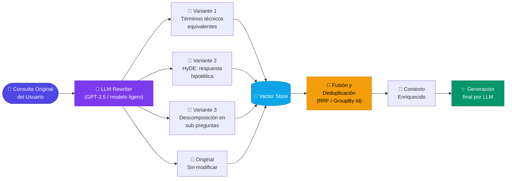

# 4.6 Reescritura de consultas (*Query Rewriting*) para LLMs

En el contexto de un pipeline de RAG avanzado, la **reescritura de consultas** (o *Query Rewriting*) aborda un problema fundamental: la brecha semántica entre cómo un usuario formula una pregunta y cómo la información está indexada en la base de datos vectorial. 

A menudo, las consultas de los usuarios son ambiguas, demasiado cortas, carecen de términos técnicos clave o contienen referencias implícitas que el sistema de búsqueda vectorial no puede resolver eficientemente. La reescritura de consultas utiliza el propio LLM como un paso de pre-procesamiento para transformar la entrada del usuario en una o varias consultas optimizadas antes de realizar la búsqueda.

### Por qué es necesaria la reescritura de consultas

1.  **Ambigüedad:** El usuario puede preguntar "¿Cómo funciona?" después de una conversación previa, lo cual no tiene valor semántico para una búsqueda vectorial aislada.
2.  **Diferencia de vocabulario:** El usuario usa lenguaje coloquial mientras que los PDFs técnicos usan terminología especializada.
3.  **Consultas complejas:** Una sola pregunta puede requerir información de múltiples fragmentos de documentos que no se encuentran en el mismo espacio vectorial.

### Técnicas Principales de Reescritura

#### 1. Expansión de Consultas (Multi-Querying)
Consiste en generar múltiples variaciones de la consulta original desde diferentes perspectivas. Al ejecutar 3 o 5 búsquedas en lugar de una, aumentamos las probabilidades de "tocar" los fragmentos de texto relevantes en la base de datos vectorial.

#### 2. HyDE (Hypothetical Document Embeddings)
En lugar de buscar por la pregunta, el LLM genera una "respuesta hipotética" (aunque sea falsa o contenga alucinaciones). Luego, se utiliza el embedding de esa respuesta hipotética para realizar la búsqueda. La lógica es que un documento real se parecerá más a una respuesta técnica que a una pregunta breve.

#### 3. Descomposición de Consultas
Si el usuario hace una pregunta compuesta, el LLM la desglosa en sub-preguntas atómicas que se ejecutan de forma independiente.



---

### Implementación en .NET con Semantic Kernel

A continuación, se muestra cómo implementar un componente de **Multi-Querying** utilizando **Semantic Kernel**. Este patrón intercepta la consulta original y genera tres versiones optimizadas para mejorar el *Recall*.

```csharp
using Microsoft.SemanticKernel;
using Microsoft.SemanticKernel.Connectors.OpenAI;

public class QueryRewriter
{
    private readonly Kernel _kernel;

    public QueryRewriter(Kernel kernel)
    {
        _kernel = kernel;
    }

    public async Task<List<string>> RewriteAndExpandAsync(string originalQuery)
    {
        // Definimos el prompt para la reescritura
        string prompt = @"
            Eres un asistente experto en optimización de búsquedas vectoriales.
            Tu tarea es recibir una consulta de usuario y generar 3 variantes exactas 
            que ayuden a encontrar la información relevante en documentos PDF técnicos.
            
            Consulta original: {{$input}}

            Genera exactamente 3 variantes, una por línea, sin numeración ni explicaciones adicionales.";

        var executionSettings = new OpenAIPromptExecutionSettings 
        { 
            Temperature = 0.3, // Mantener coherencia técnica
            MaxTokens = 200 
        };

        var result = await _kernel.InvokePromptAsync(prompt, new KernelArguments(executionSettings) 
        {
            { "input", originalQuery }
        });

        // Procesamos la salida para obtener una lista de strings
        var rewrittenQueries = result.ToString()
            .Split('\n', StringSplitOptions.RemoveEmptyEntries | StringSplitOptions.TrimEntries)
            .ToList();

        // Siempre incluimos la original para no perder la intención primaria
        if (!rewrittenQueries.Contains(originalQuery))
            rewrittenQueries.Add(originalQuery);

        return rewrittenQueries;
    }
}
```

### Integración en el Pipeline de Recuperación

Una vez obtenidas las consultas reescritas, el proceso en C# debe ejecutarlas en paralelo contra nuestro proveedor de búsqueda (como Azure AI Search o Qdrant) y luego consolidar los resultados.

```csharp
public async Task<List<RetrievedDocument>> ExecuteAdvancedRetrieval(string userInput)
{
    // 1. Reescritura
    var queries = await _queryRewriter.RewriteAndExpandAsync(userInput);

    // 2. Búsqueda paralela (Simulación de llamadas a base de datos vectorial)
    var searchTasks = queries.Select(q => _vectorStore.SearchAsync(q, limit: 3));
    var resultsSets = await Task.WhenAll(searchTasks);

    // 3. Fusión y Eliminación de Duplicados
    // Aquí es común aplicar técnicas como Reciprocal Rank Fusion (RRF)
    var uniqueResults = resultsSets
        .SelectMany(x => x)
        .GroupBy(doc => doc.Id)
        .Select(group => group.First())
        .ToList();

    return uniqueResults;
}
```

### Consideraciones Técnicas

*   **Latencia:** Cada reescritura implica una llamada adicional al LLM. En aplicaciones de tiempo real, esto debe balancearse. Se recomienda usar modelos más rápidos y económicos (como GPT-3.5 Turbo o modelos locales pequeños vía ONNX) para esta tarea específica.
*   **Contextualización:** Si el sistema tiene memoria (sección 4.8), el reescritor debe recibir el historial de chat. Por ejemplo, si el usuario dice "Dime más sobre eso", el reescritor debe transformar "eso" en el concepto específico mencionado anteriormente en la conversación.
*   **Validación:** Es vital asegurar que el LLM no invente temas nuevos que no estaban en la consulta original, lo cual podría desviar la búsqueda hacia documentos irrelevantes (ruido).

La reescritura de consultas es el primer paso para transformar un sistema RAG "de juguete" en una solución empresarial robusta capaz de manejar la imprecisión del lenguaje humano.