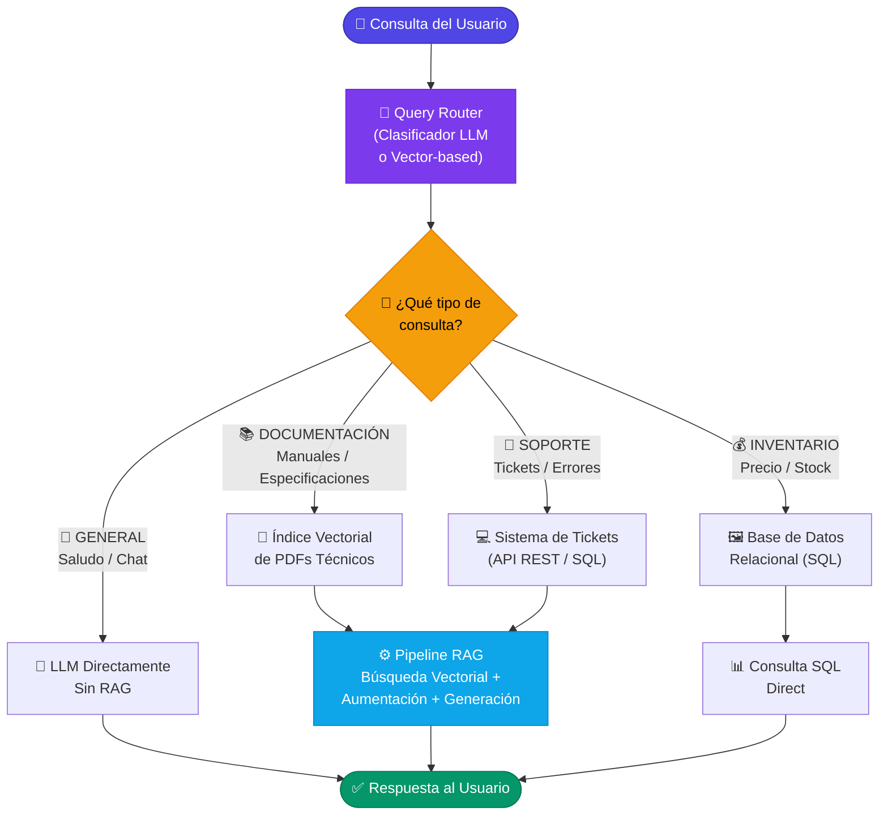

# 4.7 Enrutamiento de consultas (*Query Routing*) en RAG

El **Enrutamiento de Consultas (Query Routing)** es una técnica avanzada de RAG que actúa como una capa de toma de decisiones antes de que se realice cualquier operación de búsqueda. A diferencia de un pipeline RAG lineal, donde todas las consultas pasan por el mismo proceso de recuperación, el enrutador analiza la intención del usuario y la redirige al almacén de datos, técnica o modelo más adecuado.

En sistemas complejos de .NET, el enrutamiento es fundamental cuando trabajamos con múltiples fuentes de información (por ejemplo, manuales técnicos en PDFs, bases de datos SQL para inventarios y FAQs en Markdown) o cuando queremos optimizar costos y latencia.

### 1. ¿Por qué es necesario el Query Routing?

A medida que el corpus de documentos crece y se diversifica, un único índice vectorial puede volverse ruidoso. El enrutamiento resuelve varios problemas:

*   **Especialización de fuentes:** Si un usuario pregunta por el "precio de un producto", es más eficiente consultar una base de datos relacional que buscar en fragmentos de texto de un PDF.
*   **Optimización de costos:** Consultas simples pueden resolverse con modelos más pequeños o cachés locales, mientras que consultas complejas requieren el pipeline RAG completo.
*   **Reducción de ruido:** Evita buscar en documentos irrelevantes que podrían introducir "alucinaciones" en la respuesta final.

### 2. Tipos de Enrutadores en .NET

Existen dos enfoques principales para implementar esta lógica en C#:

#### A. Enrutamiento basado en Clasificación (LLM Classifier)
Se utiliza un modelo de lenguaje (como GPT-4o-mini) para clasificar la consulta en categorías predefinidas. En .NET, esto se implementa fácilmente mediante **Semantic Kernel** utilizando prompts estructurados.

#### B. Enrutamiento Semántico (Vector-based)
Se comparan los embeddings de la consulta contra "centroides" o ejemplos de categorías conocidos. Si la consulta está vectorialmente cerca del grupo "Soporte Técnico", se enruta a ese índice específico.



### 3. Implementación Práctica con Semantic Kernel

A continuación, se muestra cómo implementar un enrutador de consultas que decide entre dos fuentes de datos: un índice vectorial de manuales técnicos y un servicio de tickets de soporte.

```csharp
using Microsoft.SemanticKernel;
using Microsoft.SemanticKernel.Connectors.OpenAI;

public class QueryRouter
{
    private readonly Kernel _kernel;

    public QueryRouter(Kernel kernel)
    {
        _kernel = kernel;
    }

    public async Task<string> RouteQueryAsync(string userQuery)
    {
        // Definimos las rutas disponibles
        var routerPrompt = @"
            Eres un clasificador de consultas experto. 
            Tu tarea es determinar el destino óptimo para la consulta del usuario.
            
            Destinos disponibles:
            1. [DOCUMENTACION]: Para preguntas técnicas sobre manuales, instalación o especificaciones.
            2. [SOPORTE]: Para preguntas sobre estado de tickets, reportar errores o contacto humano.
            3. [GENERAL]: Para saludos o preguntas que no requieren datos externos.

            Consulta: {{$input}}

            Responde ÚNICAMENTE con el nombre del destino entre corchetes.";

        var routingFunction = _kernel.CreateFunctionFromPrompt(routerPrompt);
        
        var result = await _kernel.InvokeAsync(routingFunction, new() { ["input"] = userQuery });
        string destination = result.ToString().Trim();

        return destination switch
        {
            "[DOCUMENTACION]" => await ExecuteVectorSearchRAG(userQuery),
            "[SOPORTE]" => await QuerySupportSystem(userQuery),
            _ => await ExecuteGeneralResponse(userQuery)
        };
    }

    private async Task<string> ExecuteVectorSearchRAG(string query) 
    {
        // Lógica de recuperación vectorial (visto en secciones 2.5 y 3.2)
        return "Respuesta desde el índice de PDFs...";
    }

    private async Task<string> QuerySupportSystem(string query)
    {
        // Lógica para consultar una API de tickets o base de datos relacional
        return "Respuesta desde el sistema de soporte...";
    }

    private async Task<string> ExecuteGeneralResponse(string query)
    {
        return await _kernel.InvokePromptAsync<string>(query) ?? "No puedo procesar la solicitud.";
    }
}
```

### 4. Enrutamiento Lógico con Metadatos y Azure AI Search

Si utilizamos **Azure AI Search** (mencionado en la sección 2.5.2), podemos implementar un enrutador más ligero que no dependa de un LLM para la clasificación, sino de filtros de metadatos dinámicos.

Por ejemplo, si la consulta detecta automáticamente el idioma o una categoría mediante el SDK de .NET, el enrutador puede inyectar un parámetro `filter` en la búsqueda vectorial:

```csharp
var searchOptions = new VectorSearchOptions
{
    Filter = "category eq 'manuales_servidores_hp'", // Enrutamiento lógico basado en metadatos
    Size = 3
};
// La búsqueda se restringe solo al subconjunto de documentos relevante.
```

### 5. Consideraciones de Rendimiento

El Query Routing añade un paso adicional al pipeline, lo que implica latencia. Para mitigar esto en aplicaciones .NET de alto rendimiento:

1.  **Modelos Ligeros:** Utilice modelos como GPT-3.5-Turbo o modelos locales vía **ONNX Runtime** para la clasificación, reservando los modelos potentes para la generación final.
2.  **Streaming:** Si el enrutador decide que no se necesita RAG, el sistema debe comenzar a emitir (stream) la respuesta inmediatamente al cliente (Blazor o ASP.NET Core) para mejorar la percepción de velocidad.
3.  **Caché de Intenciones:** Almacenar pares `Consulta -> Destino` comunes en una base de datos de clave-valor como Redis para evitar llamadas repetidas al clasificador.

El enrutamiento de consultas prepara el terreno para el siguiente nivel de sofisticación: el **RAG basado en Agentes** (Sección 4.10), donde el sistema no solo elige una ruta predefinida, sino que utiliza herramientas de forma autónoma para resolver la consulta.