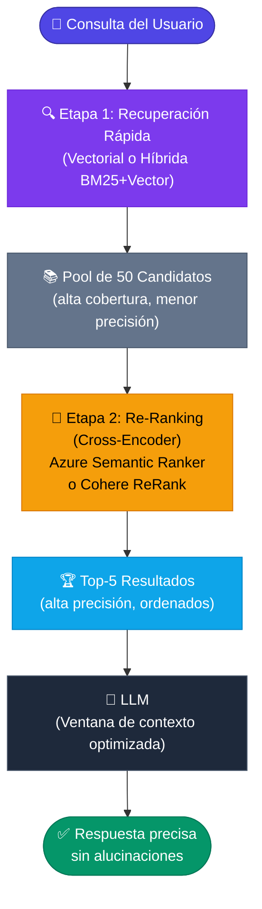

# 4.9 Re-clasificación (*Re-ranking*) de resultados (*Uso de Azure AI Search Semantic Ranker o Cohere API*)

## 4.9 Re-clasificación (Re-ranking) de resultados

En las secciones anteriores hemos explorado cómo la búsqueda vectorial (basada en *embeddings*) y la búsqueda híbrida (combinando vectores con BM25) nos permiten recuperar documentos relevantes de una base de datos vectorial. Sin embargo, estos métodos a menudo priorizan la **recuperación** (obtener tantos documentos potencialmente relevantes como sea posible) sobre la **precisión** absoluta en el orden de los resultados.

Aquí es donde entra en juego la **Re-clasificación o Re-ranking**. Es la etapa final del proceso de recuperación en un pipeline de RAG Avanzado, donde un modelo más potente (y generalmente más costoso computacionalmente) evalúa la relevancia exacta entre la consulta del usuario y los fragmentos recuperados para reorganizarlos.

### El concepto de Recuperación en Dos Etapas

Para entender el re-ranking en .NET, debemos visualizar el flujo de datos como un embudo:

1.  **Etapa 1 (Retrieval):** Se realiza una búsqueda rápida (Vectorial o Híbrida) sobre millones de documentos. Obtenemos, por ejemplo, los 50 mejores candidatos.
2.  **Etapa 2 (Re-ranking):** Tomamos esos 50 candidatos y los pasamos por un **Cross-Encoder**. A diferencia de los modelos de embeddings (Bi-Encoders) que procesan la consulta y el documento por separado, el re-ranker procesa la consulta y el fragmento de texto de forma conjunta para determinar una puntuación de relevancia mucho más exacta.



### Opción A: Azure AI Search Semantic Ranker

Si estás utilizando **Azure AI Search** (antes conocido como Azure Cognitive Search) como tu base de datos vectorial (visto en la sección 2.5.2), Microsoft ofrece una funcionalidad nativa llamada **Semantic Ranker**. Esta tecnología utiliza modelos de lenguaje de gran escala (basados en la tecnología de Bing) para re-clasificar los resultados sin necesidad de mover los datos a un servicio externo.

#### Implementación en C# con `Azure.Search.Documents`

Para utilizar el re-ranker semántico, debemos configurar el `SearchOptions` en nuestro cliente de .NET:

```csharp
using Azure;
using Azure.Search.Documents;
using Azure.Search.Documents.Models;

public async Task<List<SearchResult>> GetRankedResultsAsync(string query, SearchClient searchClient)
{
    var options = new SearchOptions
    {
        // 1. Configuramos la búsqueda híbrida (Vector + Texto)
        QueryType = SearchQueryType.Semantic,
        SemanticSearch = new SemanticSearchOptions
        {
            SemanticConfigurationName = "my-semantic-config", // Configurado previamente en el portal de Azure
            QueryCaption = new QueryCaption(QueryCaptionType.Extractive),
            QueryAnswer = new QueryAnswer(QueryAnswerType.Extractive)
        },
        Size = 5, // Solo queremos los 5 mejores después del re-ranking
        Select = { "content", "metadata", "title" }
    };

    // La búsqueda se realiza en dos pasos internos por el motor de Azure
    Response<SearchResults<PdfDocumentChunk>> response = await searchClient.SearchAsync<PdfDocumentChunk>(query, options);

    var results = new List<SearchResult>();
    await foreach (SearchResult<PdfDocumentChunk> result in response.Value.GetResultsAsync())
    {
        results.Add(new SearchResult
        {
            Text = result.Document.Content,
            // RerankerScore es la puntuación tras la re-clasificación semántica
            Score = result.SemanticSearch.RerankerScore 
        });
    }

    return results;
}
```

### Opción B: Cohere ReRank API

En escenarios donde no utilizas Azure AI Search (por ejemplo, si usas Qdrant, Milvus o PostgreSQL con `pgvector`), la mejor alternativa es utilizar un servicio externo especializado como **Cohere ReRank**. Este es un modelo de "Cross-Encoder" accesible vía API que acepta una consulta y una lista de textos, devolviendo una lista ordenada por relevancia.

#### Implementación con un Cliente HTTP en .NET

Aunque existen SDKs de la comunidad, la integración directa es sencilla mediante `System.Net.Http.Json`:

```csharp
public class CohereReranker
{
    private readonly HttpClient _httpClient;
    private const string ApiUrl = "https://api.cohere.ai/v1/rerank";

    public CohereReranker(string apiKey)
    {
        _httpClient = new HttpClient();
        _httpClient.DefaultRequestHeaders.Add("Authorization", $"Bearer {apiKey}");
    }

    public async Task<List<string>> RerankAsync(string query, List<string> documents)
    {
        var requestBody = new
        {
            model = "rerank-multilingual-v2.0", // Soporta español
            query = query,
            documents = documents,
            top_n = 3 // Retornar solo los 3 más relevantes
        };

        var response = await _httpClient.PostAsJsonAsync(ApiUrl, requestBody);
        var result = await response.Content.ReadFromJsonAsync<CohereResponse>();

        // Reordenar la lista original basada en el índice devuelto por Cohere
        return result.Results
            .OrderByDescending(r => r.RelevanceScore)
            .Select(r => documents[r.Index])
            .ToList();
    }
}

// Clases auxiliares para la respuesta de Cohere
public record CohereResult(int Index, double RelevanceScore);
public record CohereResponse(List<CohereResult> Results);
```

### Comparativa y Consideraciones Técnicas

| Característica | Azure AI Search Semantic Ranker | Cohere ReRank API |
| :--- | :--- | :--- |
| **Integración** | Nativa en el ecosistema Azure. | Funciona con cualquier base de datos. |
| **Latencia** | Baja (procesamiento interno). | Media (requiere llamada HTTP externa). |
| **Costo** | Basado en el plan de Azure Search. | Pago por uso (por cada 100 fragmentos). |
| **Capacidad** | Excelente para documentos técnicos. | Líder en modelos multi-idioma (Español). |

#### ¿Por qué usar Re-ranking en tu Pipeline RAG?

1.  **Reducción de Alucinaciones:** Al entregarle al LLM (Sección 3.3) solo fragmentos extremadamente relevantes, reducimos la probabilidad de que intente "adivinar" basándose en ruido recuperado por error.
2.  **Optimización de Contexto:** Los LLMs tienen una ventana de contexto limitada. El re-ranking asegura que la información más crítica esté en las primeras posiciones (los LLMs sufren del efecto *Lost in the Middle*, donde ignoran información en medio de prompts largos).
3.  **Búsqueda Semántica Real:** Mientras que la búsqueda vectorial se basa en distancias matemáticas entre embeddings, el re-ranker puede entender matices lingüísticos como la negación o el sarcasmo, que los modelos de embeddings a veces pasan por alto.

En el siguiente paso (4.10), veremos cómo integrar estos resultados ya refinados en un sistema de **Agentes** utilizando Semantic Kernel para ejecutar acciones basadas en la información recuperada.